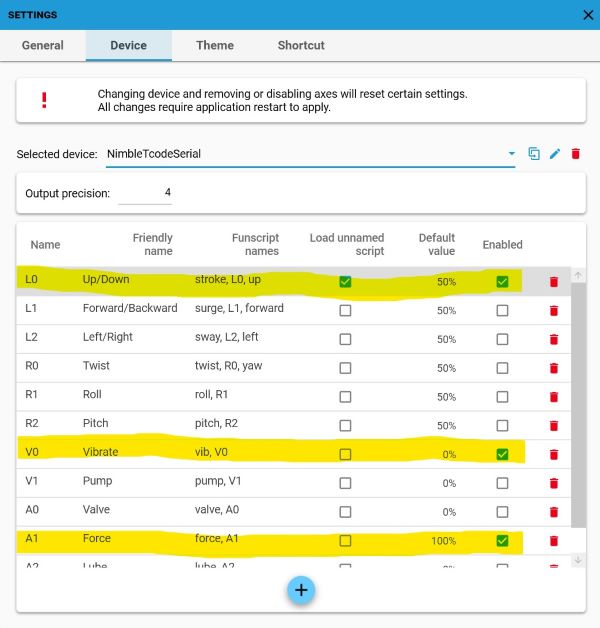
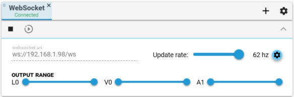

# NimbleTCodeWifi

Firmware that implements the [Toy Code (T-Code) v0.3](https://github.com/multiaxis/tcode-spec) protocol over Wifi/Websocket for the [Nimble Connectivity Module](https://shop.exploratorydevices.com/product/connectivity-module-dev-kit/), an ESP32 controller for the [NimbleStroker](https://shop.exploratorydevices.com/).

Tested with MultiFunPlayer's WebSocket output type, which connects to a Websocket Server running on the NimbleConModule and sends T-Code commands as messages to the device. The T-Code commands are converted into position values which are then sent to the NimbleStroker actuator.

To connect the NimbleConModule to your local network:
1. Long press the encoder button until you see the flashing white Wifi LED. This indicates the device is in Local AP mode.
2. Using any wifi-enabled device with a browser (computer, phone, tablet) connect to the newly created Access Point named `NimbleTCodeWifi`.
3. Upon connecting, a Captive Portal should pop up, allowing you to configure the device for your local network, entering its SSID and password.
4. After Saving the configuration, the device will reboot and connect to the network with a local IP address. A steady white LED indicates it is connected.
5. From here you can connect to the websocket server and send commands. A blue LED will turn on when a client is connected.

If the device fails to connect to the network (ie. incorrect password), it will re-enter Local AP mode, where you will need to reconnect and reattempt the configuration.

## TCode Information

- `D0` - Identity device and firmware version: `NimbleStroker_TCode_Serial_v0.3`
- `D1` - Identify TCode version: `TCode v0.4`
- `D2` - List available axes and user range preferences:
  - `L0 0 9999 Up`: **Up/down position** linear motion (default: `5000`)
    - Maps to NimbleStroker positions: -750 to 750
  - `V0 0 9999 Vibe`: **Vibration intensity** (default: `0`)
    - An oscillation is applied to the position when sent to the NimbleStroker.
    - Maps to the amplitude of oscillation: 0 to 25 (position units)
  - `A0 0 9999 Air`: **Auxilliary air in/out valve** (default `5000`)
    - Value `0000` = air-out valve (looser)
    - Value `5000` = stop valve (default)
    - Value `9999` = air-in valve (tighter)
  - `A1 0 9999 Force`: **Force command** (default `9999`)
    - Maps to NimbleStroker force command values: 0 to 1023
    - Controls the air pressure force of the actuator(?)
  - `A2 0 9999 VibSpeed`: **Vibration speed** (default: `9999`)
    - Maps to an oscillation speed for vibration: 0 to 20hz (default 20hz)

Other info:

- Sending live control values to an axis will ease to the target value over multiple frames rather than jump immediately when the difference in change is large (> 100 t-code units, or >50 position units). This is intended to protect the user and device. ([Source1](https://github.com/mnh86/NimbleTCodeSerial/blob/6ab66638b2670115e770fdee9d2ec5c7b04f9390/include/TCodeAxis.h#L217-L228), [Source2](https://github.com/mnh86/NimbleTCodeSerial/blob/6ab66638b2670115e770fdee9d2ec5c7b04f9390/src/main.cpp#L104-L111))
- Up/down position axis values that are sent to the NimbleStroker are set as (-750 to 750) instead of the full [documented range of (-1000 to 1000)](https://github.com/ExploratoryDevices/NimbleConModule/blob/31f09fbcaa068b3d7fe8d47e44ea5ed11437c852/README.md?plain=1#L30) to avoid piston damaging the actuator (slamming occurs at min/max ranges). This aligns with the same max/min values that the NimbleStroker Pendant sends to the actuator, from debug log analysis.
- [Acutuator feedback values](https://github.com/ExploratoryDevices/NimbleConModule/blob/31f09fbcaa068b3d7fe8d47e44ea5ed11437c852/README.md?plain=1#L24-L27) are not currently returned back to clients in this firmware.

## Usage

1. Install [Windows Virtual COM Port (VCP) drivers](https://github.com/mnh86/NimbleConModule/blob/feat/docs/docs/setup-guide-windows-arduino-ide1.md#install-windows-virtual-com-port-vcp-drivers) for the USB/serial connection to the module.
2. Set up [VSCode with PlatformIO](https://randomnerdtutorials.com/vs-code-platformio-ide-esp32-esp8266-arduino/)
3. Clone this repo and open the project in VSCode
4. Build and upload this program into the NimbleConModule (USB/serial)
5. Attach the NimbleConModule to the actuator (Label A)
   - Note: Pendant connection not supported
6. Long press the Encoder Dial (2 seconds) to reset Wifi configuration and enable the configuration portal.
7. Click the Encoder Dial to toggle stop/start sending commands to the actuator.

## Testing with MultiFunPlayer

1. Launch the [MultiFunPlayer](https://github.com/Yoooi0/MultiFunPlayer) application.
2. In the Output section, add a `WebSocket` device (plus sign).
3. Set the websocket uri with the device's IP address (ie. `ws://192.168.1.100/ws`).
4. Test the connection with the play button.
5. (Optional) To configure additional axes (L0, V0, A0, A1, A2) for multi script support...
6. Open the Output Configuration panel.
7. Clone the `TCode-0.3 (default)` config, name it `NimbleTCode`.
8. Enable the channels you'd like to use. ie.:
   - `L0` Up/Down (Select "Load unnamed script") - Default value: `50%`
   - `V0` Vibrate - Default value: `0%` (off state)
   - `A0` Valve - Default value: `50%` (off state)
   - `A1` Force (can rename) - Default value: `100%` (max)
   - `A2` Vibspeed (can rename) - Default value: `100%` (max)
9. See screenshots below.

## Attributions

- <https://github.com/ExploratoryDevices/NimbleConModule> - Official NimbleConSDK
- <https://github.com/tzapu/WiFiManager> - For Wifi Captive Portal functionality
- <https://github.com/esphome/ESPAsyncWebServer> - For websocket server functionality
- <https://github.com/tyrm/nimblestroker/> - Nimblestroker examples
- <https://github.com/Dreamer2345/Arduino_TCode_Parser> - TCode library

See also [platformio.ini](./platformio.ini) for other 3rd party OSS libraries used in this project.